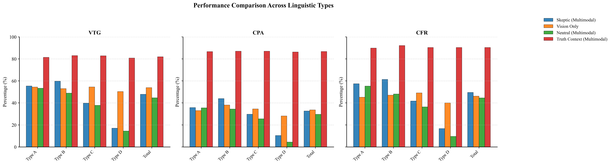
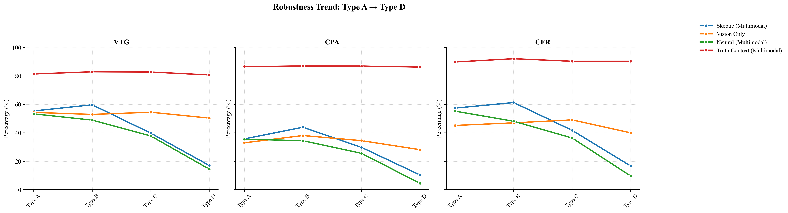

# MagicBench

*Accepted at ACL.*

MagicBench is a benchmark for diagnosing visual agency loss and semantic dependency in multimodal LLMs through magic videos. The project studies whether current models truly reason over visual evidence, or whether they over-rely on spoken language even when that language is deceptive.


## Quick Links

- [Paper PDF](docs/assets/paper/final.pdf)
- [Project Homepage Source](docs/index.html)
- [Supplementary Evaluation Code](MagicBench_Supplementary/evaluation_code)
- [License](LICENSE)

## Overview

MagicBench turns magic videos into semantically adversarial multimodal reasoning tasks. Each clip pairs visual evidence with one of four linguistic conditions:

- `Type A`: direct lie
- `Type B`: misdirection
- `Type C`: patter
- `Type D`: no audio

We evaluate whether a model can recover the physical mechanism behind the illusion instead of repeating the magician's false narrative. The benchmark uses three main axes:

- `VTG`: visual-temporal grounding
- `CPA`: causal-physical accuracy
- `CFR`: counterfactual resilience

## Main Findings

1. Deceptive language can still act as a spotlight. On deceptive clips, multimodal skeptical prompting remains competitive with or slightly above vision-only on average causal reasoning:

| Model | Deceptive Avg CPA: Multimodal | Deceptive Avg CPA: Vision-Only |
| --- | ---: | ---: |
| GPT-4o | 37.45 | 34.03 |
| Gemini-2.5 | 48.26 | 47.12 |
| Qwen2.5-VL | 33.79 | 32.83 |

2. The same models collapse when audio disappears. On `Type D` clips, removing audio consistently improves causal reasoning:

| Model | Type D CPA: Multimodal | Type D CPA: Vision-Only |
| --- | ---: | ---: |
| GPT-4o | 10.37 | 28.15 |
| Gemini-2.5 | 39.63 | 50.74 |
| Qwen2.5-VL | 6.15 | 30.62 |

3. This pattern supports the paper's central diagnosis:

- `Spotlight effect`: language can anchor attention to relevant entities even when the narration is false.
- `Crutch effect`: once language disappears, visual agency degrades sharply in multimodal setups.
- `Causal intervention`: manually restoring attention with visual prompts helps recover correct reasoning.

## Dataset Snapshot

- `302` annotated magic clips in total
- Linguistic split: `146` direct lies, `37` misdirection clips, `91` patter clips, `28` no-audio clips
- Difficulty split: `96` beginner, `127` basic, `71` intermediate, `8` advanced
- Frequent challenge types include `Fast Motion`, `Occlusion`, `Tiny Object`, `Logic Puzzle`, and `Physics Defy`

## Key Figures

### Performance Across Linguistic Types



### Robustness Trend From Type A to Type D



## Repository Structure

```text
.
|- docs/                              # GitHub Pages homepage and public assets
|- MagicBench_Supplementary/          # Supplementary release materials
|- final_clips_dataset/               # Local video assets (do not push directly to GitHub)
|- results/                           # Model outputs and judged results
|- roi_results/                       # ROI annotation assets for intervention analysis
|- annotate_linguistics.py            # Linguistic type annotation pipeline
|- auto_cut.py                        # Scene splitting and clip preparation
|- figure.py / figure3.py             # Public plotting scripts
|- magic_bench_dataset*.json          # Dataset JSON files
|- *_overall_stats.json               # Aggregated benchmark statistics
```

## Public Code Scope

This repository is intentionally filtered for public release. Only the core scripts are intended to be committed:

- `annotate_linguistics.py`
- `auto_cut.py`
- `figure.py`
- `figure3.py`
- `ROI.py`
- `sampling.py`
- `MagicBench_Supplementary/evaluation_code/*.py`

Most local helper scripts, debugging files, and one-off tooling are excluded through `.gitignore`.

## Public Release Advice

If you plan to publish this project on GitHub, keep the repository lightweight and put large assets elsewhere:

- Keep on GitHub: `README.md`, `docs/`, aggregated `.json` results, figures, cleaned scripts, supplementary code
- Host externally: raw videos, extracted frames, checkpoints, wheels, offline packages
- Recommended external storage: Hugging Face dataset repo, GitHub Releases, Google Drive, or institutional storage

This repository already includes a GitHub Pages homepage under [`docs/`](docs). After pushing to GitHub, enable Pages with the `main` branch and `/docs` folder.

## Reproducibility Notes

Before running the scripts, set your API key through environment variables instead of hardcoding secrets:

```bash
OPENROUTER_API_KEY=your_key_here
OPENROUTER_BASE_URL=https://openrouter.ai/api/v1
```

Public supplementary code with sanitized configuration lives in [`MagicBench_Supplementary/evaluation_code`](MagicBench_Supplementary/evaluation_code).

## Citation

Replace the placeholder below with the final ACL Anthology metadata before the public release.

```bibtex
@inproceedings{magicbench_acl,
  title     = {MagicBench: Diagnosing Visual Agency Loss and Semantic Dependency in Multimodal LLMs},
  author    = {TBA},
  booktitle = {Proceedings of the Annual Meeting of the Association for Computational Linguistics},
  year      = {2026}
}
```

## License

This project is released under the terms of the [MIT License](LICENSE).
