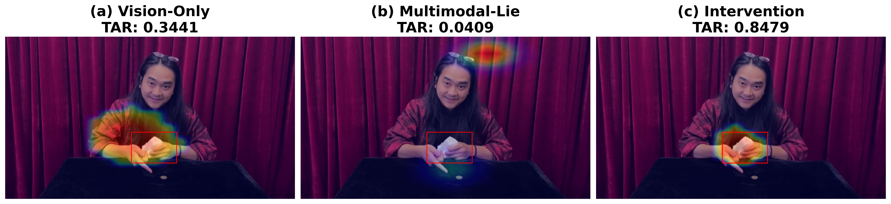

# MagicBench

*Accepted at ACL 2026.*

MagicBench is a diagnostic benchmark for evaluating visual agency loss and semantic dependency in multimodal LLMs. Using magic tricks as semantically adversarial tasks, it investigates whether models genuinely reason over visual evidence or merely over-rely on deceptive spoken language.



## Quick Links

- [Paper (OpenReview)](https://openreview.net/forum?id=JeJEgZoXPm)
- [Dataset Download (Baidu Netdisk)](https://pan.baidu.com/s/13veWd4WVU0rN8vpkmnbfiw?pwd=y36t) *(Extraction code: `y36t`)*
- [Project Homepage](docs/index.html)
- [License](LICENSE)

## Main Findings

MagicBench pairs visual evidence with four linguistic conditions: `Type A` (Direct Lie), `Type B` (Misdirection), `Type C` (Patter), and `Type D` (Silence/No Audio). We evaluate models across Visual-Temporal Grounding (VTG), Causal-Physical Accuracy (CPA), and Counterfactual Resilience (CFR).

1. **The Spotlight Effect:** In deceptive scenarios (`Type A` & `Type B`), entity nouns act as semantic anchors that facilitate visual grounding. Multimodal models often outperform their vision-only counterparts despite the false predicates.
2. **The Crutch Effect (Visual Agency Loss):** In semantic vacuums (`Type D`), multimodal performance collapses significantly (e.g., GPT-4o drops 12.4%), revealing a persistent under-utilization of available visual evidence when linguistic triggers are absent. 

**Causal-Physical Accuracy (CPA) Comparison (from Table 3):**

| Model | Type A (Lie)<br>Multi / Vision | Type B (Misdirection)<br>Multi / Vision | Type D (Silence)<br>Multi / Vision |
| :--- | :---: | :---: | :---: |
| **GPT-4o** | **43.4** / 33.0 | **43.3** / 38.1 | 15.8 / **28.2** |
| **Gemini-2.5-Pro** | 42.1 / **47.3** | 45.8 / **46.3** | 37.8 / **50.7** |
| **Qwen2.5-VL-72B**| **48.7** / 32.4 | **40.3** / 34.5 | 22.7 / **30.6** |

*(Note: "Multi" refers to the Symmetric Intensity Ablation `Multi-Forensic` setting, and "Vision" refers to the `Vision-Only` capability probe.)*

*Conclusion:* Current early-fusion MLLMs behave more like *language-guided passive observers* than autonomous visual reasoners.

## Dataset Snapshot

- **Size:** 402 annotated high-fidelity magic videos.
- **Linguistic Split:** 146 Direct Lies (Type A), 91 Misdirections (Type B), 83 Patters (Type C), 82 Silences (Type D).
- **Physical Constraint Set (PCS):** Grounded in First-Order Logic to verify Object Permanence, Kinematic Continuity, and Visual Supremacy.

## Repository Structure

```text
.
├── docs/                                  # GitHub Pages assets
├── final_clips_dataset/                   # Local video assets (Download externally)
├── MagicBench_Supplementary/              # Evaluation and auto-judging code
│   └── evaluation_code/
├── magic_bench_dataset_with_timestamps.json # Primary dataset file
├── magic_bench_dataset_pro.json           # Expanded dataset (for extension experiments)
├── results/                               # Output directory for model inferences
└── *.py                                   # Helper scripts for dataset extension & visualization
```

## Getting Started

### 1. Download the Dataset
Download the full dataset from [Baidu Netdisk](https://pan.baidu.com/s/13veWd4WVU0rN8vpkmnbfiw?pwd=y36t) (Code: `y36t`) and extract it. We recommend placing the extracted `frames/` and `final_clips_dataset/` directories directly in the project root.

### 2. Install Dependencies
```bash
pip install -r MagicBench_Supplementary/evaluation_code/requirements.txt
```
*(Optional)* If you plan to extend the dataset using our video processing scripts, also install: `pip install openai-whisper torch tqdm` and ensure `ffmpeg` is installed.

### 3. Configuration
Set up your OpenRouter API keys and update the local paths in the core evaluation scripts:

- **For Evaluation** (`MagicBench_Supplementary/evaluation_code/run_experiment.py`):
  Update `API_KEY`, `INPUT_JSON` (point to `magic_bench_dataset_with_timestamps.json`), and `FRAMES_ROOT` (point to your extracted frames directory).
  
- **For Judging** (`MagicBench_Supplementary/evaluation_code/auto_judge.py`):
  Update `API_KEY` and ensure `INPUT_FILES` points to your generated result JSONs.

- **For Dataset Extension** (`annotate_linguistics.py`):
  Set your environment variables before running:
  ```bash
  export OPENROUTER_API_KEY="your_openrouter_key"
  export OPENROUTER_BASE_URL="https://openrouter.ai/api/v1"
  ```

### 4. Run the Benchmark
Step 1: Run model inference.
```bash
python MagicBench_Supplementary/evaluation_code/run_experiment.py
```
Step 2: Run the LLM-as-a-judge protocol to grade the predictions.
```bash
python MagicBench_Supplementary/evaluation_code/auto_judge.py
```

## Citation

```bibtex
@inproceedings{
  huang2026magicbench,
  title={MagicBench: Diagnosing Visual Agency Loss and Semantic Dependency in Multimodal {LLM}s},
  author={Tang Da Huang and Weidong Tang and Wen Qi Xu and Xianpeng Guo},
  booktitle={The 64th Annual Meeting of the Association for Computational Linguistics},
  year={2026},
  url={https://openreview.net/forum?id=JeJEgZoXPm}
}
```

## License
This project is released under the [MIT License](LICENSE).
